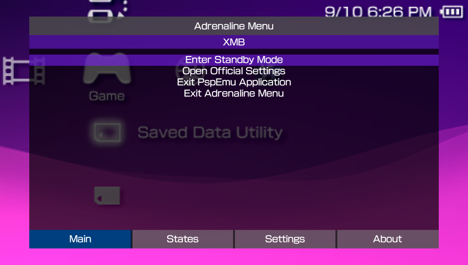
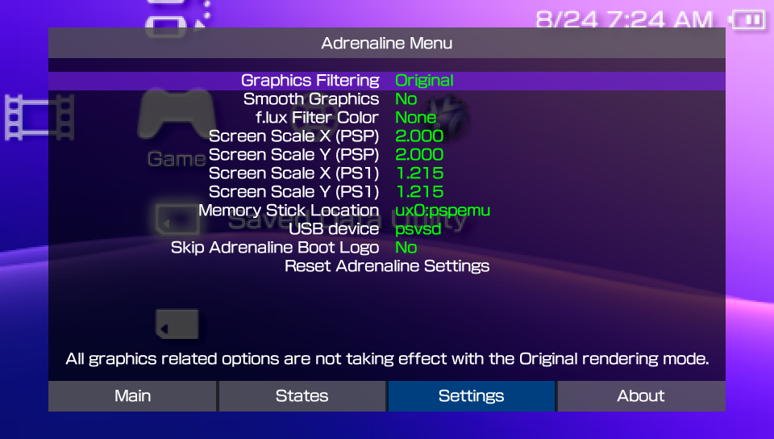

# Adrenaline Menu
---

Adrenaline Menu is a menu that you access Adrenaline information, Adrenaline Application settings, the save state feature, and more.

The Adrenaline Menu

To open the Adrenaline menu, you have to:

1. Hold the `HOME` button to open the PSVita/PSTV's **Quick Menu**
2. Click on the `Settings` button on the screen

Once opened, you can notice it has four tabs: `Main`, `States`, `Settings`, and `About`.

 
 

## Main tab

This tab has the launched application information (title and title ID) and the most basic options, detailed bellow.

- `Enter Standby Mode`: Make the system enter standby mode
- `Open Official Settings`: Opens the official PSVita/PSTV PSPemu game settings
- `Exit PspEmu Application`: Exits the application
- `Exit Adrenaline Menu`: Closes the menu

## States

This tab has the front UI for the native save state feature of Adrenaline. You can find more information on this feature on the [Save State](./03-AdrenalineMenu/01-SaveState.md) page.

## Settings

This tab has the Adrenaline App configuration options. You can find more information on each of the settings at [Adrenaline Settings](./03-AdrenalineMenu/02-AdrenalineSettings.md) page.

## About

This tab shows the Adrenaline version and credits.