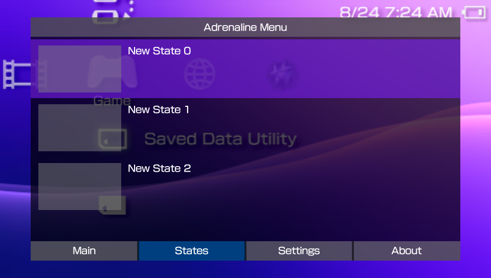
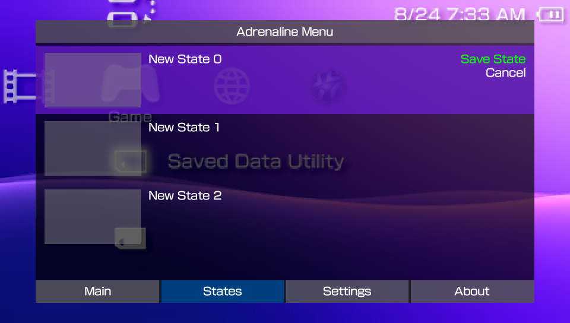

# Adrenaline Save State
---

Adrenaline has native support to Save States, accessible in the [Adrenaline Menu](../04-AdrenalineMenu.md). It supports the creation of up to 31 save states.

## What is a Save State

A save state is a snapshot of the current status of a game, allowing you to save and restore your progress at any point. Unlike traditional in-game saves, save states capture everything in memory, so you can resume exactly where you left off, even if the game itself doesn’t support saving at that moment.

## Creating Save State

To create a save state, do the following:

1. Open **Adrenaline Menu**
    1. Hold the `HOME` button to open PSVita/PSTV's **Quick Menu**
    2. Click on the `Settings` button on the screen
2. Press `L` or `R` until you reach the **States** tab
3. Select an empty state slot
4. Press `X`, select **Save State**, and press `X` to save the state

Alternatively, you can save the state by substituting a previously saved state (i.e. overwriting the save state):

1. Open **Adrenaline Menu**
    1. Hold the `HOME` button to open the PSVita/PSTV's **Quick Menu**
    2. Click on the `Settings` button on the screen
2. Press `L` or `R` until you reach the **States** tab
3. Select an empty state slot
4. Press `X`, select **Overwrite State**, and press `X` to overwrite the state

## Loading Save State

To load a save state, do the following:

1. Open **Adrenaline Menu**
    1. Hold the `HOME` button to open PSVita/PSTV's **Quick Menu**
    2. Click on the `Settings` button on the screen
2. Press `L` or `R` until you reach the **States** tab
3. Select a saved state slot
4. Press `X`, select **Load State**, and press `X` to load the state

## Deleting Save State

To delete a save state, do the following:

1. Open **Adrenaline Menu**
    1. Hold the `HOME` button to open PSVita/PSTV's **Quick Menu**
    2. Click on the `Settings` button on the screen
2. Press `L` or `R` until you reach the **States** tab
3. Select a saved state slot
4. Press `X`, select **Delete State** and press `X` to delete the state

