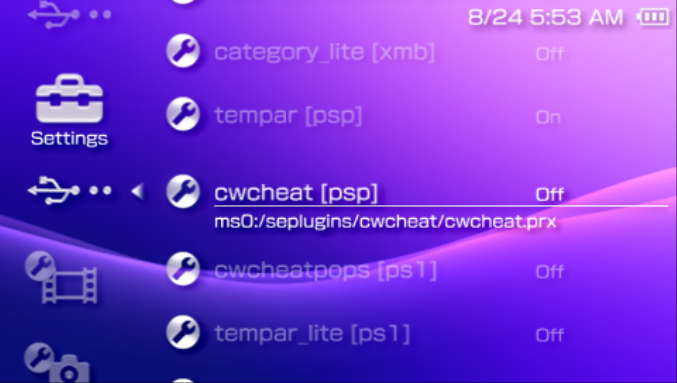
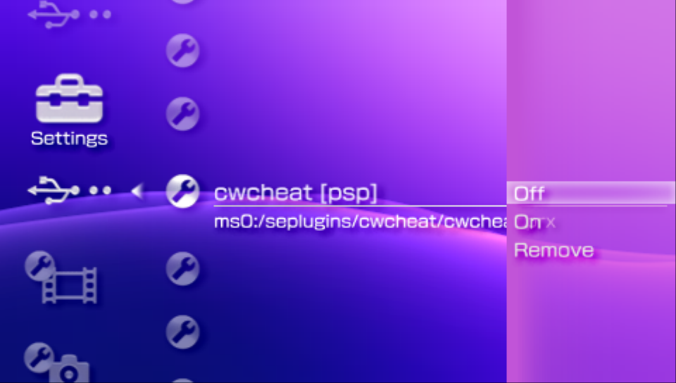
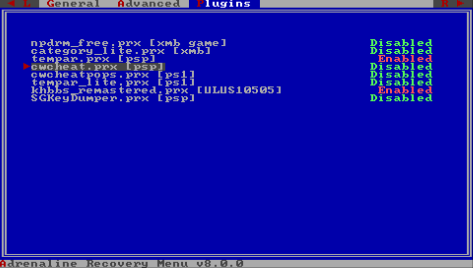

# PSP Plugin
---

PSP plugins are small programs (usually `.prx` files) that add new features or modify the behavior of the PSP system or games.

Adrenaline should be compatible with most of the plugins made for classic PSP CFW, but incompatibilities may happen. Plugins that replace the VSH Menu (i.e. System Menu, Ultimate VSH Menu, etc) are not supported.

> [!TIP]
> If you find a plugin that is not working, first open an issue on the plugin project issue tracker before opening an issue on Adrenaline issue tracker.
>
> If you end up opening an issue on Adrenaline issue tracker, be mindful that issue resolution depends on many factors, as developers time, developers interest on the issue, external contribution and more; as any hobbyist open-source project.

## Adding a plugin

1. Put the `.prx` file somewhere on `???0:/pspemu/seplugins/` directory (create if it doesn't exist)
2. Open the `???0:/pspemu/seplugins/EPIplugins.txt` (create if it doesn't exist)
3. Add to the configuration line in the general format: `⟨RUNLEVELS⟩, ⟨PLUGIN PATH⟩, ⟨on/off⟩`

	- Example: `psp, ms0:/seplugins/my_plugin.prx, on`
	- You can find detailed information on the format [on the next page](./02-PluginConfigFormat.md)
	- You can find an configuration example [here](./02-PluginConfigFormat.md#example)

> [!IMPORTANT]
> Before version 8.0.0, Adrenaline used another format and files for the plugins
>
> If you just updated from previous version, Adrenaline provides an easy way to import the old style to the new:
>
> 1. Open Recovery Menu
> 2. Go to the `Advanced` section
> 3. Select and click on `Import classic plugins`
>
> 
  

## Managing Plugins

Adrenaline offers two ways to manage plugins already added.

### First method: XMB Settings

1. On XMB, go to the `Settings`
2. Find the `★ Plugins Manager` and the confirmation button, a list of added plugins will show up
3. Select the plugin, click the confirmation button.
4. Select the the state (`on`/`off`/`remove`), confirm with the confirmation button.

	- The `remove` option will remove the line of the configuration file and restart the system
5. Return back to save configuration.

<!--   -->

> [!WARNING]
> Modification of the plugin state on any plugin that has XMB/VSH runlevel (`xmb`/`vsh`) needs to restart the XMB/VSH to take effect.

### Second method: Recovery Menu

<!-- TODO: LINK TO RECOVERY MENU -->
1. Open Recovery Menu
2. Go to the `Plugins` section
3. Go over your plugins and use `←`/`→` to select the plugin state
4. Go back to the `General` section
5. Exit the Recovery Menu

