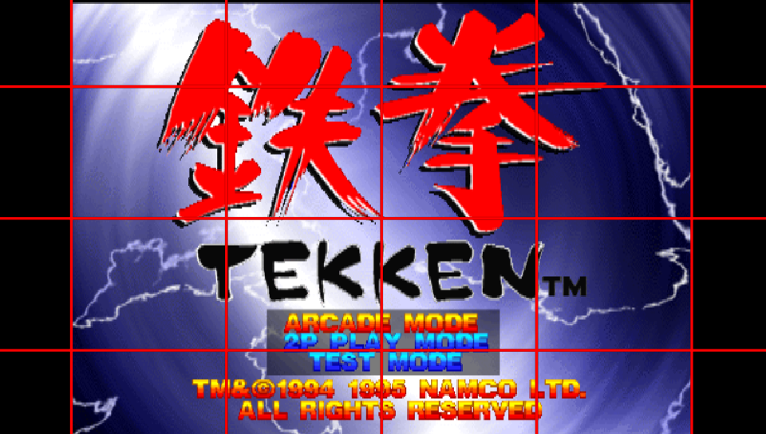

# PS1 Playback
---

Adrenaline allows the user to execute official PS1 games and custom PS1 games/applications on PlayStation Vita or PSTV.

A custom PS1 game/app needs to be in the PSP `EBOOT.PBP` format and be stored on `???0:/pspemu/PSP/GAME/⟨GAME_ID⟩/` directory. Once added, the game/app can be launched from the XMB without any further configuration.

> [!TIP]
> The recommended tool to convert a custom PS1 game/app to a PSP format is [`pop-fe`](https://github.com/sahlberg/pop-fe) as it not only supports other platforms such as PS2 and PS3, but it also has improved compatibility with converted games thanks to the use of a database of custom configuration files for many games and game versions.

> [!CAUTION]
> An older alternative to `pop-fe` is `PSX2PSP`, it is an unmaintained project and has lower compatibility than `pop-fe`, more so in the case of VITA/PSTV. A game converted with `PSX2PSP` will show up in Adrenaline, and most likely run, but will be unable to use custom POPS configuration, as the tool doesn't add a required section in the outputted `PBP` file to do custom POPS configuration injection.

Adrenaline comes with a set of added features tailored for better support of custom PS1 games/apps.

## CDDA Support
---

**CD Direct Audio** was one of the methods (along with the proprietary XA format) to encode sound in PS1 games.
Games that use CDDA are usually separated into different tracks, with the first one being the main data track and the rest being CD audio tracks. Many regular CD players were capable of playing these audio tracks when a PS1 disc was inserted.

The PS1 emulator was originally coded to use CD audio tracks packaged into the EBOOT itself, however on later firmware revisions, Sony decided to replace those CDDA tracks with equivalent tracks encoded (and compressed) in AT3 format, which the PSP could also decode and play, this was done to drastically reduce the size of some PS1 games that used a lot of the disc space for CDDA.

Though Sony replaced CDDA with AT3, they didn't really remove the ability to play CDDA-encoded games; they just disabled it.
A plugin known as `cdda_enabler` developed by `theFl0w` was released to re-enable CDDA functionality in the PS1 emulator, allowing games encoded with the older format to be playable with full working sound (whereas before they would produce no sound).

The patch to re-enable CDDA has been added to Adrenaline's `PopCorn` module (the custom PS1 driver) from the start of the project, meaning that it is not necessary to use the `cdda_enabler` plugin on Adrenaline.

## Custom POPS Configuration
---

The PS1 emulator for PSP/Vita (POPS) allows for custom configuration to be injected in the structure of the PBP, allowing per-game fixes. This is used by some titles officially released on the PSN version.

With Adrenaline, you can implement these custom patches in a single external file `CONFIG.BIN`, stored alongside the `EBOOT.PBP` of the custom PS1 game/app (i.e. `???0:/pspemu/PSP/GAME/⟨GAME_ID⟩/`), without the need to be injected into the `EBOOT.PBP` file; as the CFW will do that for you on-the-fly.

## Anti-LibCrypt patch
---

Adrenaline contains a patch to defeat `libcrypt` protection for known games without requiring rebuilding the `PBP` file.

This patch is applied automatically to games that are detected to need it and does not require any configuration from the user.

## Overlay Image
---

With Adrenaline, you can include an extra overlay filter based on an image. You can set one image overlay per PS1 game.

The image ideally should be `960x544` pixels, but if not, it should be stretched anyway. And the image must be stored as `???0:/pspemu/overlays/⟨PS1_GAME_ID⟩.png`.

> [!WARNING]
> This only take effect with [Graphics Filtering](./03-AdrenalineMenu/02-AdrenalineSettings.md#graphics-filtering) different than `Original`.

> [!EXAMPLE]
> **Note:** This is an not useful example; made just to show off clearly the overlay working.
>
> 

> 
> 
