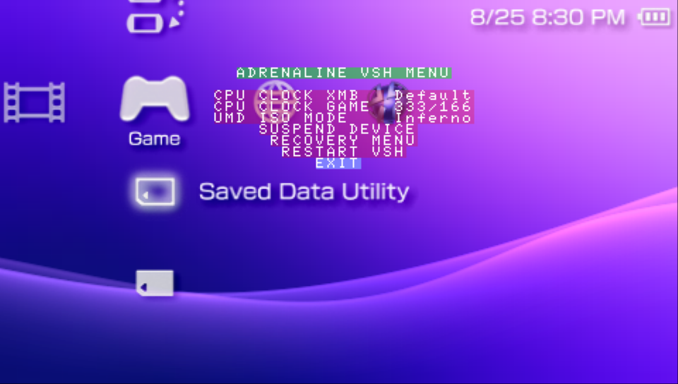

# Adrenaline VSH Menu
---

VSH Menu is a menu that can be accessed while on XMB/VSH. It contains the most common CFW configurations that users of Adrenaline change with more frequency and quick commands.

To access this menu, click the `Select` button while on XMB/VSH.

## Available features

- Modify the CPU/BUS speed for the XMB/VSH
- Modify the CPU/BUS speed for PSP Games
- Modify the ISO driver to use when launching ISO games
- Quick option to suspend the device
- Quick option to restart the system in the [Recovery Menu](./09-RecoveryMenu.md)
- Quick option to restart XMB/VSH
