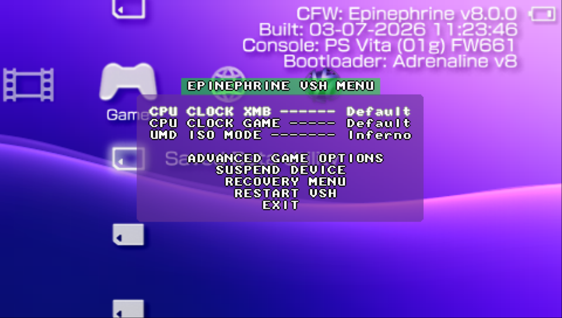
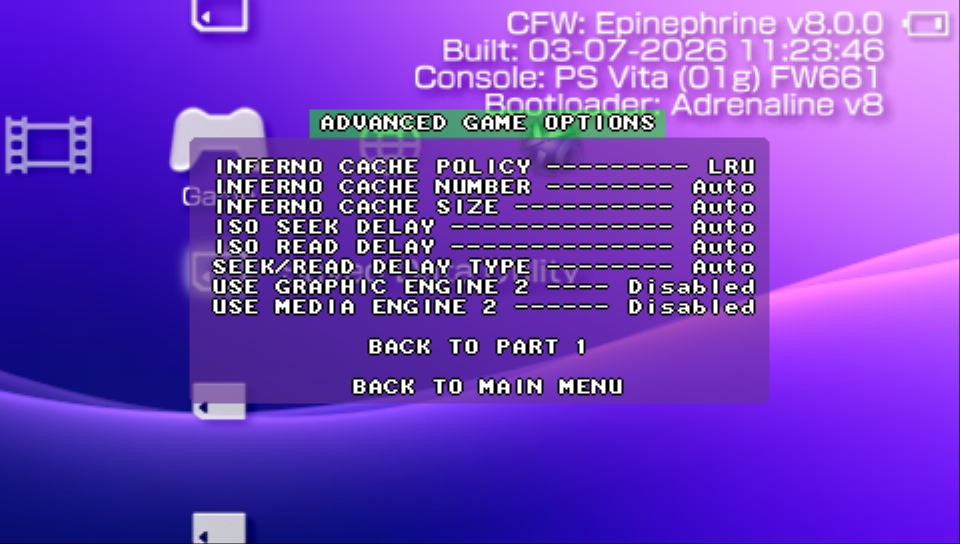
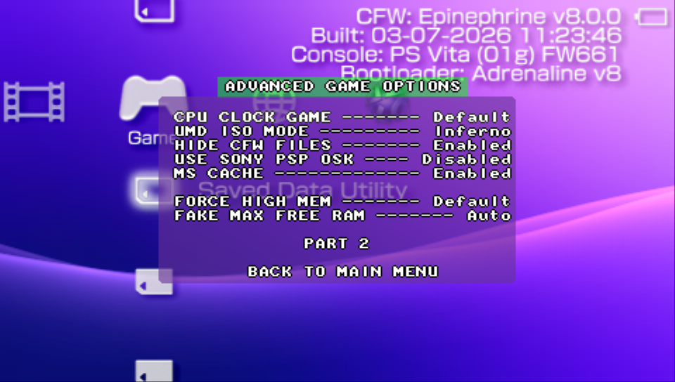
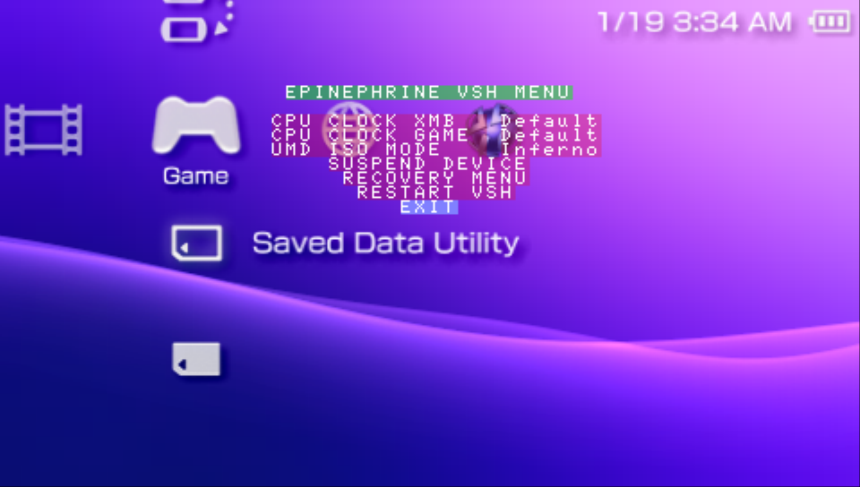

# Epinephrine VSH Menu
---

VSH Menu is a menu that can be accessed while on XMB/VSH. It contains the most common CFW configurations that users of Epinephrine change with more frequency and quick commands.

To access this menu, click the `Select` button while on XMB/VSH.

Epinephrine comes with two flavours of the VSH Menu: `Modern` and `Classic`.

The `Modern` is a re-implementation from scratch that uses GU on VSH, a recently developed way to GPU render graphics while on XMB/VSH. Yes, that means this implementation is GPU rendered. It also contais some quality-of-life improvements, like following the defined button to function as enter/back. Besides that, this new implementation also extends the functionality to provide a quick access to advanced game options; this were made to make testing configuration on game titles not working faster.

Initially this implementation was developed to demonstrate the usage of the VSH-GU.

The `Classic` is more basic, but nostalgic-looking implementation. It has less features but good enough for day-to-day.

## Available common features

- Modify the CPU/BUS speed for the XMB/VSH
- Modify the CPU/BUS speed for PSP Games
- Modify the ISO driver to use when launching ISO games
- Quick option to suspend the device
- Quick option to restart the system in the [Recovery Menu](./09-RecoveryMenu.md)
- Quick option to restart XMB/VSH

## Modern-specific

- Considers the assigned enter button for the inputs
- Quick advanced game options to help test configuration for not-working titles