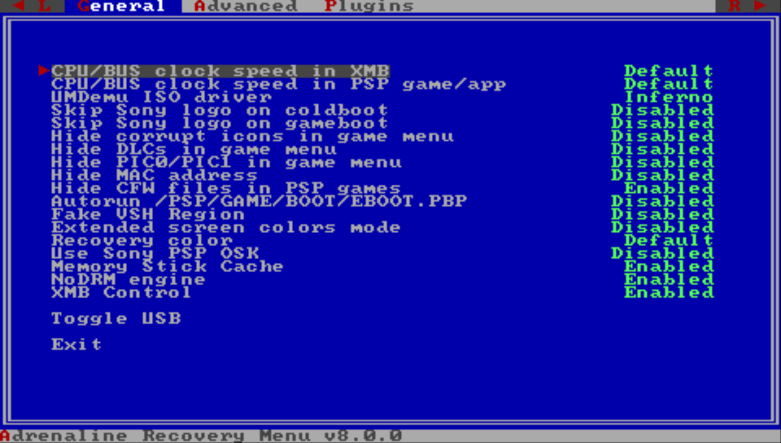
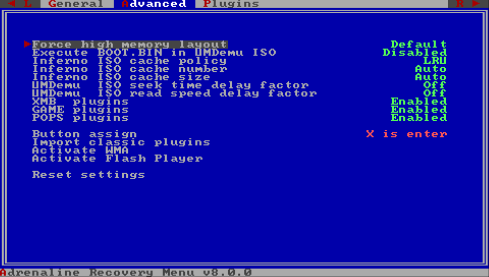

# Adrenaline Recovery Menu
---

The Adrenaline Recover Menu allows the user to modify the Adrenaline CFW Settings, work as a plugin manager and extra features.

There are two ways to enter in the Recovery Menu. Either on XMB, by opening the [VSH Menu](./07-VSHMenu.md) and selecting the `RECOVERY MENU` option, or opening the Adrenaline Application while holding the `R` button.

The Recovery Menu has three sections: `General`, `Advanced` and `Plugin`.

## General

This section is more focused on the [General CFW Settings](./08-CfwConfiguration.md#general-settings). But it contains a couple of extra itens detailed bellow.

### Toggle USB

Switch the state of USB connection while on Recovery Mode.

### Exit

Exit the Recovery Menu and restart the vPSP system.

## Advanced

This section is more focused on the [Advanced CFW Settings](./08-CfwConfiguration.md#advanced-settings). But it contains a few extra itens detailed bellow.

### Button assign

Configures what button is used for confirmation/enter.

#### Options:

- `⭕️ is enter`
- `❌ is enter`

### Import classic plugins

Imports the classic plugin configuration (`/seplugins/vsh.txt`, `/seplugins/game.txt`, `/seplugins/pops.txt`) to the new format at `???0:/pspemu/seplugins/EPIplugins.txt`.

> [!WARNING]
> If you already have a `???0:/pspemu/seplugins/EPIplugins.txt` file, it will be overwritten by this action.

### Activate WMA

Enables WMA playback without connecting to the internet.

### Activate Flash Player

Enables Flash Player  without connecting to the internet.

### Reset settings

Resets the CFW settings to the default values.

## Plugins

This is the Recovery Menu plugin manager. Here you can select a plugin and change its value to `Disabled` or `Enabled`.

