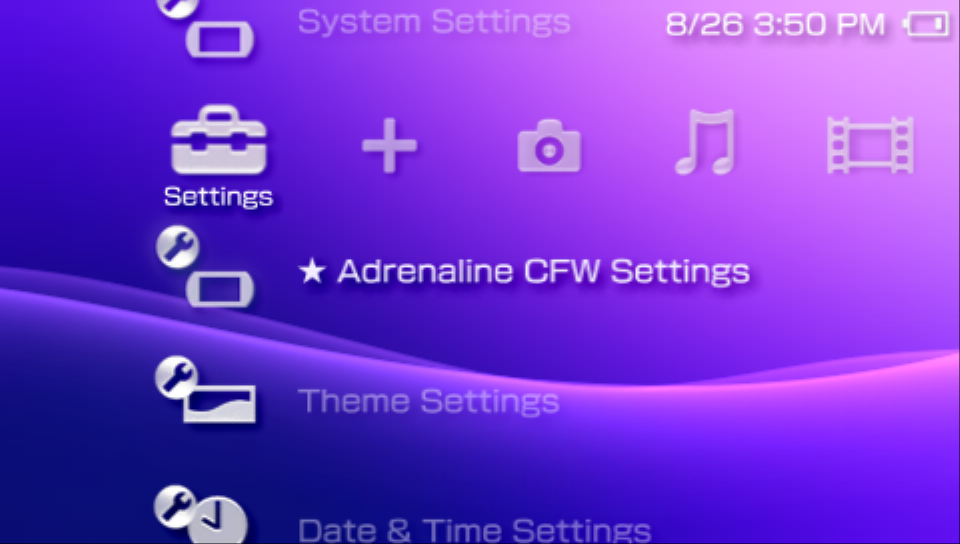
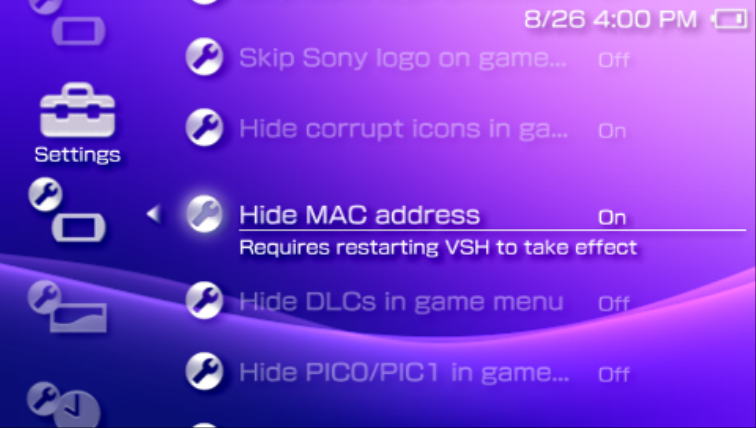

# XMB CFW Menus
---

Adrenaline adds extra menus to the XMB that allows the user to change CFW setting and work as a plugin manager.

## ★ Adrenaline CFW settings

This menu can be found at `Settings` section of the XMB. It allows to modify the [Adrenaline CFW Settings](./08-CfwConfiguration.md).

Some options may require that the system to be restarted before taking effect. This will be informed in the menu (third image).

## ★ Plugins Manager

This menu can be found at `Settings` section of the XMB. It allows to modify the [plugin configuration](./04-HomebrewSupport/02-PluginConfigFormat.md) directly from the XMB.

Once opened, it will show the list of plugins, their runlevels and their path. Clicking the enter button, it allows to select the state of the plugin entry (`On`, `Off`, `Remove`).

The `Remove` option will remove the configuration line related to the plugin configuration file and restart the XMB.

