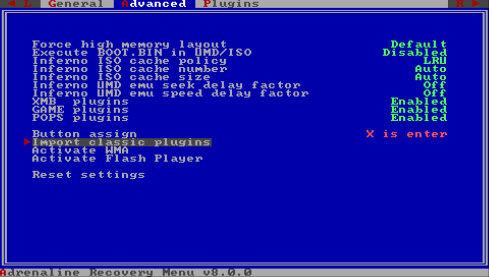

# Changelog
---

## Unreleased
---

- **Breaking change:** New plugin configuration format **\[[docs](./04-HomebrewSupport/02-PluginConfigFormat.md)\]**
    - Only one configuration file `/pspemu/seplugins/EPIplugins.txt`
    - Finer control over when to enable/disable plugins
    - Support for plugins in specific games
    - Support for plugin only on homebrew apps
	- **Migration instructions below**
- Add option to select the vPSP Custom Firmware to use **\[[docs](./03-AdrenalineMenu/02-AdrenalineSettings.md#vpsp-custom-firmware)\]**
- Add `Scale2x` graphical filter options **\[[docs](./03-AdrenalineMenu/02-AdrenalineSettings.md#graphics-filtering)\]**
- Add `Scale3x` graphical filter options **\[[docs](./03-AdrenalineMenu/02-AdrenalineSettings.md#graphics-filtering)\]**
- Add support for launching `JSO`, `ZSO`, `CSOv2`, and `DAX` compressed ISO formats using any ISO driver. **\[[docs](./05-PSPPlayback.md#umdemu-iso-drivers)\]**
- Update the Inferno Driver to Inferno 2 **\[[docs](./05-PSPPlayback/02-Inferno.md)\]**
- Introduce March33 Driver v2: An evolution of the March33 ISO driver **\[[docs](./05-PSPPlayback/03-March33.md)\]**
- Introduce an improved implementation of the GalaxyController **\[[docs](./05-PSPPlayback/04-Galaxy.md)\]**
- Introduce CFW Settings on the XMB **\[[docs](./10-XmbCfwMenus.md#-adrenaline-cfw-settings)\]**
- Introduce Plugin Manager on the XMB **\[[docs](./10-XmbCfwMenus.md#-plugins-manager)\]**
- Improve stability of the `Force High Memory` CFW option. **\[[docs](./08-CfwConfiguration.md#force-high-memory-layout)\]**
- Improve the speed and efficiency of all UMDemu ISO drivers **\[[docs](./05-PSPPlayback.md#umdemu-iso-drivers)\]**
- Add Custom POPS Configuration injection for custom or converted PS1 game/apps **\[[docs](./06-PS1Playback.md#custom-pops-configuration)\]**
- Patch libcrypt for custom or converted PS1 game/apps **\[[docs](./06-PS1Playback.md#anti-libcrypt-patch)\]**
- Add image overlay filter for PS1 game/apps **\[[docs](./06-PS1Playback.md#overlay-image)\]**
- Add `Memory Stick Cache` to speedup I/O operations in the Memory Stick drive (`ms0`) **\[[docs](./08-CfwConfiguration.md#memory-stick-cache)\]**
- Add `Use Graphic Engine 2` and `Use Media Engine 2` advanced CFW options **\[[docs](./08-CfwConfiguration.md#use-graphic-engine-2)\]**
- Add `Hide CFW files in PSP games` general CFW option **\[[docs](./08-CfwConfiguration.md#hide-cfw-files-in-psp-games)\]**
- Implement "Hold L while launching apps" to not load plugins **\[[docs](./04-HomebrewSupport/01-Plugin.md#launch-without-plugins)\]**
- Implement "Hold R while launching ISO apps/games" to execute `BOOT.BIN` instead of `EBOOT.BIN` **\[[docs](./08-CfwConfiguration.md#execute-bootbin-in-umdemu-iso)\]**
- Implement PSP native music player and `SenseMe` to continue to play music after system suspend
- Add quick exit to VSH key combos **\[[docs](./01-Intro.md#key-combos-cheat-sheet)\]**
  - PSP games/homebrew: `L+R+Down+Select` or `L+R+Down+Start`
  - PS1 games: `L2+R2+Down+Select` or `L2+R2+Down+Start`
- "Fix" manual double launch on first install
- Fix wrongly module privilege level reset on official apps and set it to user privilege level on homebrews
  - Fix `SenseMe` launch error
  - Fix potential issues related to privilege level to other official apps
  - Fix homebrew software not able to call some `sceKernelLoadModule*` functions that they should be able to use
- **Game Compatibility:**
	- Fix PBP collection games (e.g. `Ys I&II`, `Sega Genesis Collection`) crashing after game selection
	- Fix `BEATS` custom tracks
	- Fix the infinite loading screen on `Jackass: The Game`
	- Fix `The Simpsons Game` crashing during the start of the game
	- Fix `TwinBee Portable` crashing when not using English or Japanese language
	- Fix `Smakdown vs RAW 2009` by bypassing anti-CFW check
	- Fix `Smakdown vs RAW 2010` by bypassing anti-CFW check
	- Fix `Smakdown vs RAW 2011` by bypassing anti-CFW check
	- Fix `Aces of War` by bypassing anti-CFW check
	- Fix `Pangya Fantasy Golf` by bypassing anti-CFW check
	- Fix freeze on `Bust-A-Move` by bypassing anti-CFW check
	- Fix `Lego Star Wars II` WLAN switch state wrongly returning "off"
	- Patch to remove the "overclocked" message on `ATV Pro`

- **DEV:** Introduce the CFW library `SysclibForUser`: Export many C-lib functions for app and user-level plugins developers to use to help avoid linking to newlibc and reducing binary size
- **DEV:** Expand CFW libraries API
- **DEV:** Improve CFW API compatibility with other CFWs' API (M33, ME, PRO, and ARK): `KUBridge`, `SystemCtrlForUser`, `SystemCtrlForKernel`, and `SysclibForUser`
- **DEV:** Add support for `MEMSIZE=2` (to request only stable extra RAM)
- **DEV:** Make PSPemu `sceKernelPowerTick` to behave as the VITA `sceKernelPowerTick`
- **DEV:** Introduce `Adrenaline Log`, a C header library that developers can use even outside of Adrenaline (i.e. your project)
- **DEV:** Fix homebrew software not able to call some `sceKernelLoadModule*` functions that they should be able to use
- **DEV:** Add stubs for the UMDemu ISO drivers
- **DEV:** Add NID translation table to `sceAudioRouting_driver` (Improve plugin compatibility)

- **Internal:** Some code reorganization
- **Internal:** Code clean ups

> [!IMPORTANT] Plugin Migration Instructions
> This is how to migrate your plugins to the new format after updating Adrenaline to 8.0.0
>
> 1. Open [Recovery Menu](./09-RecoveryMenu.md)
> 2. Go to the `Advanced` section
> 3. Select and click on `Import classic plugins`
>
> 
  

## v7.1.7
---

- Fix autoboot.
- Support vita firmwares 3.71-3.74.

## v7.1.6
---

- Fix recovery plugin manager.

## v7.1.5
---

- New recovery/installer.
- Support for displaying manuals for ISO-format games.

## v7.1.4
---

- Revert fancier recovery for now (breaks installer)

## v7.1.3
---

- Don't load plugins in recovery (for real).
- Support for downloading official updates for EBOOT/ISO.
- Support for updates/dlc for EBOOT/ISO.
- Support for autoboot /PSP/GAME/EBOOT.PBP.
- Update version in LiveArea automatically.
- Support for logging psp printf's via catlog.

## v7.1.2
---

- Fixed photo/video browser.
- Don't load plugins in recovery.

## v7.1.1
---

- Fixed version info.

## v7.1
---

- Fixed XMB camera app.
- Added support for PS2/PS3 <-> PSP game link.
- Cleaner recovery with adjustable color.

## v7
---

- Fixed issue where plugins were loaded in recovery mode.
- Moved native display buffer to a different location, so GePatch works for some more games. Please note that only GePatch v0.18 or above will only work, older versions will cause a black screen. If you're using GTANativeRes, please download the latest binary as well.

## v6.9
---

- Added support for native resolution patches.

## v6.8
---

- Added sharp bilinear without scanlines filter. Thanks to rsn8887.
- Fixed PS1 slowdowns. Thanks to rsn8887.
- Fixed compatibility with h-encore 2.0.
- Fixed compatibility with udcd_uvc.skprx plugin.

## v6.7
---

- Added support for PS1 multiplayer on PS Vita using an upcoming DS3/DS4 plugin.

## v6.6
---

- Fixed bug from previous update that caused black screen in other DJ max games.
- Inferno driver was not included correcty, now it is.
- Tekken 6 can now be played with any CPU speed.

## v6.5
---

- Added updated inferno driver by codestation which improves performance of CSO reading.
- Added option to choose USB device.
- Added xmc0: option.
- Fixed stupid mistake that made DJ max portable 1 crash. **Install it again, because this has been added post-release**
- Fixed little bug in msfs.
- Removed savestate version restriction, old savestates will not disappear anymore.

## v6.4
---

- Added ability to fast forward in PS1 games by pressing L+SELECT.
- Fixed double launch bug when using without enso. You need to add the kernel module to config to do so.

## v6.3
---

- Added support for 3.68.
- Added ability to freely adjust the screen size to your desire in both psp and ps1 modes.
- Removed 'Screen Mode' and 'Screen Size' from menu.
- Improved Adrenaline Menu.

## v6.2
---

- Added f.lux by Rinnegatamante.
- Fixed PS1 framerate when using custom screen.
- Fixed bug where exiting a game with 'High memory layout' would crash.
- Fixed compatibility with 'Kingdom Hearts: Birth by Sleep' english patch, again.

## v6.1
---

- Added support for 3.65/3.67.

## v6 fix
---

- Fixed bug where CSO games freezed up the system.

## v6
---

- Redesigned boot process. Adrenaline does now not require any basegame or activation anymore.
- Added 'uma0:' to 'Memory Stick Location'.
- Added support for longer ISO filenames.
- Fixed Memory Stick free space integer overflow in games like Outrun.
- Fixed bug where ISO games did not show up when the folder 'PSP/GAME' was missing.
- Improved core and fixed some small bugs.

## v5.1
---

- Added ability to skip adrenaline boot logo.
- Added message for original filter.
- Fixed bug where payloadex was not updated and caused some bugs.
- Fixed '20000006' bug on PS TV. Network update will work on PS TV in the future.
- Changed CPU clock back to 333 MHz.

## v5
---

- Added 'Hide DLC's in game menu' functionality.
- Readded 'Original' graphics filtering, since PS1 games have got framedrops using custom filters.
- Fixed corrupted icons bug that was introduced in the previous update.
- Fixed bug where the framebuffer was corrupted after loading savestate.
- Adrenaline icon is now hidden in game menu.

## v4.2
---

- Added support for ISO sorting using 'Game Categories Lite' plugin.
- Fixed compatiblity with 'Kingdom Hearts: Birth by Sleep' english patch.

## v4.1
---

- Fixed bug where holding R trigger while launching Adrenaline didn't open the recovery menu.
- Fixed msfs truncation bug that caused savedata corruption for Little Big Planet and maybe other games.
- Fixed wrong scale of PS1 games on PS TV.

## v4
---

- Added custom graphics filtering support for PS1 games.
- Added screen mode adjustment for PS1 games. If you're using this feature on a PS Vita, select 'Original' screen mode in the
official settings, then apply the custom screen mode. On the other hand, if you want to the screen mode of the official settings,
	select 'Original' screen mode in Adrenaline settings. On a PS TV this will finally allow you to play your games in fullscreen.
- Added screenshot support in PS1 games.
- Added network update feature for future updates.
- Fixed a bug in msfs driver that caused weird behavior in XMB after resuming from standby.
- Removed 'Official' graphics filtering in order to support the features mentioned above.

## v3.1
---

- Added support for cwcheat in PS1 games.
- Fixed sound problems after exiting a PS1 game.
- Fixed 'Please wait...' bug in some games.
- Fixed problem where mounting ur0: as USB device would cause problems in livearea.

## v3 fix
---

- Fixed bug where 'Cannot find application' would show up instead of returning to livearea.
- Fixed bug where you couldn't access the Adrenaline Menu after enabling/disabling wifi.

## v3
---

- Added ability to launch PS1 games from XMB and play them with full sound.
- Added ability to save and load states using the 'States' tab in the Adrenaline menu.
- Added possibility to connect USB in XMB and added 'Toggle USB' option to recovery menu.
- Added ability to return to livearea by double tapping the PS button.
- Added Adrenaline startup image designed by Freakler.
- Added option to force high memory layout. For 'The Elder Scrolls Travels: Oblivion' Demo.
- Added option to execute 'BOOT.BIN' in UMD/ISO. For 'Saints Row: Undercover' Demo.
- Added correct enter and cancel buttons assignment.
- Fixed volatile memory allocation bug that made 'Star Wars: The Force Unleashed',
'Tony Hawk's Project 8' and maybe more games crashing.
- Fixed bug that was introduced in v2 which caused some games to crashed at PMF sequences.
- Fixed NoDrm engine bug where fan translated games couldn't load PGD decrypted files.
- Fixed msfs directory filter bug that caused some games not to recognize savedatas.
- Fixed compatiblity of base games, any game should now be able to use Adrenaline to the fullest.

## v2
---

- Added 64MB RAM support for homebrews.
- Added ability to use the 'ur0:' partition as Memory Stick.
- Added Advanced AA filter (disable 'Smooth Graphics' for that filter).
- Added ability to change smooth graphics (GPU internal bilinear filter).
- Added ability to change screen size (2.0x, 1.75x, 1.5x, 1.25x, 1.0x).
- Fixed sound issue in 'MotorStorm' and some other games.
- Fixed bug where 'ms0:/MUSIC' and 'ms0:/PICTURE' were not found in XMB.
- Fixed bug where changing options in the official settings menu didn't have any effect.
