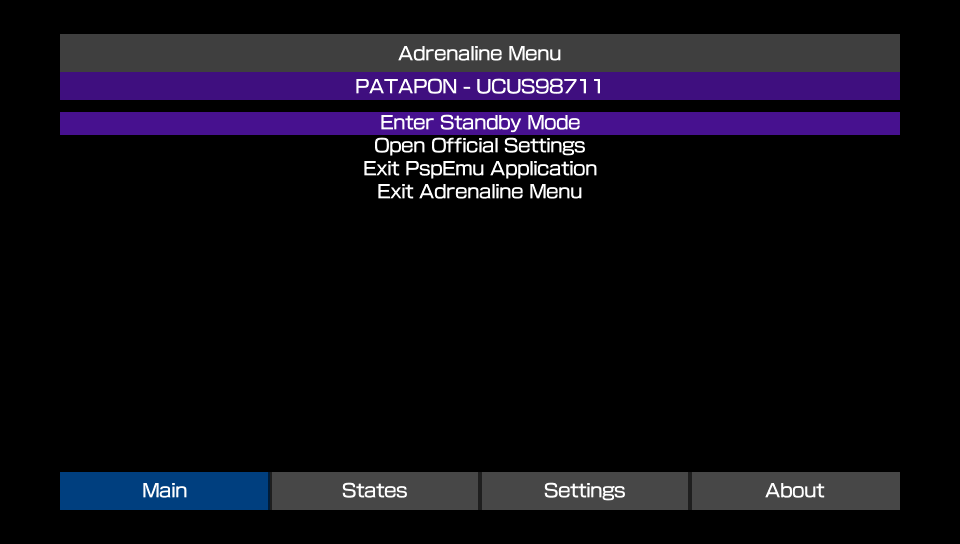

# Fun Facts and FAQ
---

## Why many things have "EPI" in the name?
---

"EPI" is the common abbreviation of **epinephrine**, which is the technical name for the hormone popularly known as **adrenaline**.

## How to get the title ID for an application/game?
---

You may want to get this information to write your plugins configuration or to report issues.

There are many ways to get this information, but the easiest with Adrenaline is to open the [Adrenaline Menu](./03-AdrenalineMenu.md) after launching the app/game and look up the information in the [Main tab](./03-AdrenalineMenu.md#main-tab).

> [!EXAMPLE]
> After opening the game, open `Adrenaline Menu` in the `Main` tab and look at the information just below the "Adrenaline Menu" header.
>
> 

> 
> 

## How to contribute/support to the project?
---

There are a number of ways to contribute to the Adrenaline project for both programmers and non-programmers alike.

- **Improving documentation**: You can improve the documentation text and information. For that, you need to send a pull request (PR) on the [Adrenaline GitHub Repository](https://github.com/isage/Adrenaline) with the changes in the files at the `docs` directory.
- **Code improvements**: If you know how to code in `C`, you can contribute by sending Pull Requests on the [Adrenaline GitHub Repository](https://github.com/isage/Adrenaline) with your changes.
- **Game/App/Homebrew incompatibility report**: If a game is not working out of the box, you can open an [Issue ticket](https://github.com/isage/Adrenaline/issues).
  - Make sure to disable any known plugins to cause issues with the application before reporting.
- **Bug reports**: Any bugs found can be reported by opening an [Issue ticket](https://github.com/isage/Adrenaline/issues).
  - Be mindful that some issues are harder to fix than others and that the project is developed in the maintainers spare time as a hobby and may take a while for some issue to be solved.
- **Feature ideas**: You can suggest a feature to be implemented on Adrenaline by opening an [Issue ticket](https://github.com/isage/Adrenaline/issues).
  - Be mindful that your request may not be possible to be implemented or be considered low priority or even impractical to be implemented.
- **Financial support**: If you like, you can help the devs with monetary support
  - Cat (isage) is currently unable to receive any international money. If you so prefer, a donation to your local animal shelter is encouraged.
  - Grayjack can receive support by [Github Sponsors](https://github.com/sponsors/GrayJack) or [PIX](https://nubank.com.br/cobrar/2a8up/68cf317a-627c-4d09-afb4-0faddf7968d3). If neither are possible to you, consider a donation to your local animal shelter.